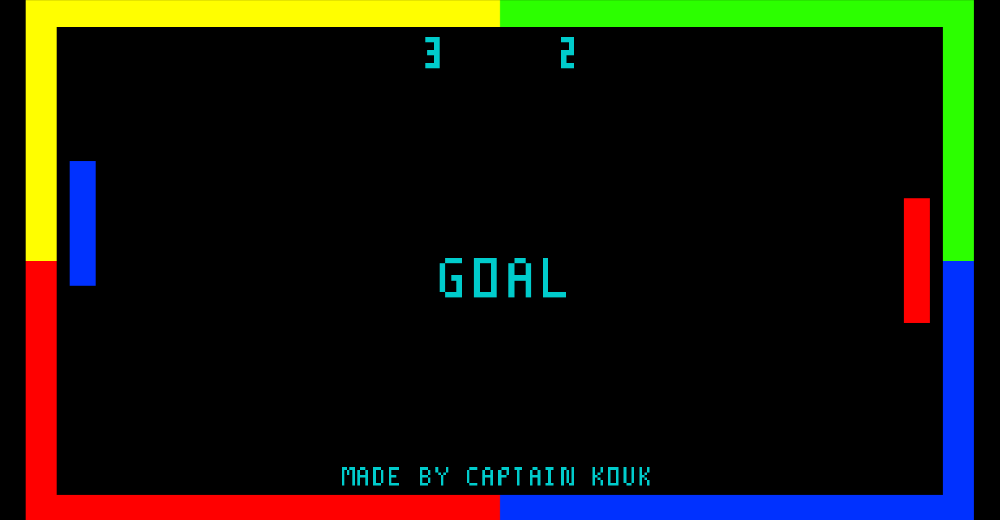

# Pong

Pong is a two-dimensional sports game that simulates table tennis. 
The player controls an in-game paddle by moving it vertically across 
the left or right side of the screen. They can compete against 
another player controlling a second paddle on the opposing side. 
Players use the paddles to hit a ball back and forth. Points are 
earned when one fails to return the ball to the other.

